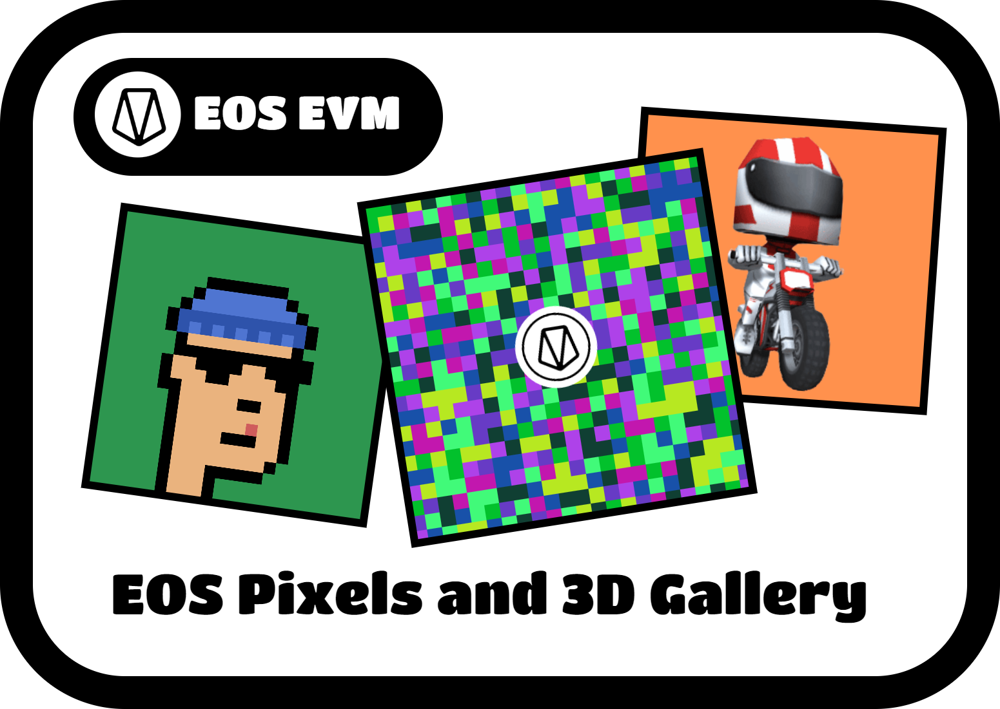

# EOS Pixels NFTs & 3D Gallery

"EOS Pixels" NFT Collection & an online 3D gallery of NFT collections from EOS EVM Network (Mainnet)

---

## Who is this project for?

The project will be of interest to users who hold NFTs on EOS EVM (Mainnet)

---

## Problems and Solutions

### a) The main problem

In every blockchain it would be nice to have a tool that would allow users to easily track their NFT assets.

###  Solution:
We created a 3D gallery that will make this possible by creating a browser world where each user can immerse themselves and view their NFTs in a new, interactive and entertaining way. It will also encourage users who don't already have NFTs on EOS EVM to do so.

###  b) The secondary problem:
On EOS EVM network, unlike other blockchains, there are almost no NFT collections !

### Solution:
We created an NFT collection on EOS EVM Mainnet and a page where everyone can mint a personal NFT. Thus, we have shown the functionality of the gallery and give a boost to the NFT ecosystem of the EOS EVM Network.

---

## Description of project sections:

- **Home page**: Contains brief information about the project;

- **Mint NFT page**: Here, users can mint a new EOS Pixels NFTs. The NFT itself is a square picture filled with pixels. The color and size of the pixels can be selected, and when the corresponding button is pressed, a new image is generated with random colors for the pixels. After connecting the wallet, users can mint NFTs;
- **3D gallery**: This is a 3D gallery in the browser, where users can also look at their collections, but in 3D form. Users can walk through this gallery and admire the NFTs on the gallery walls using the keyboard (WASD) and mouse.

### Future plans:

- Find & add new NFT collections from EOS EVM Network;
- Increase the capacity of the 3D gallery;
- Multiplayer feature;
- Ability to save the state of the gallery and share the link;
- Add background music;
- and other features;

#### Mint page:

<table>
  <tr>
    <td></td>
  </tr>
</table>

#### Example of generated NFTs:

<table>
  <tr>
    <td></td>
    <td></td>
    <td></td>
  </tr>
</table>

#### Gallery image:

<table>
  <tr>
    <td></td>
    <td></td>
  </tr>
  <tr>
    <td></td>
    <td></td>
  </tr>
</table>

